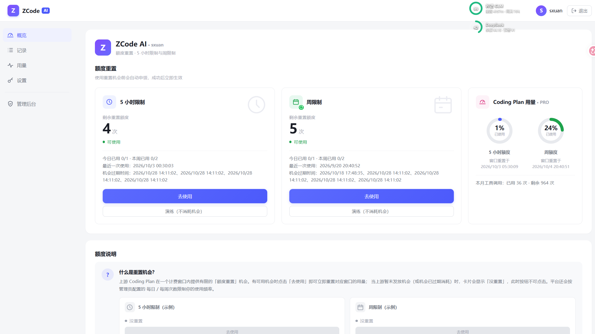

# zai-zcode-reset ZAI额度重置多租户平台

简体中文 | [English](./README.en.md)

Coding Plan 额度重置共享平台：把「只能在官网或者Zcode客户端重置我的 Coding Plan 额度」做成一套通用的的多租户系统——公开落地页 + 受控成员体系 + 管理后台 + 可配置配额规则。**上游令牌只存在于服务端**（AES-256-GCM 加密存储），浏览器永不接触。

通用方案设计见 [DESIGN.md](./DESIGN.md)。

## 界面预览

成员登录后的重置面板：5 小时 / 周限制两类重置机会（可用次数与过期时间、一键使用），以及 Coding Plan 真实用量环形图（5 小时窗口、周窗口、本月工具调用）。



## 功能

- **落地页**：公开访问，无需登录
- **成员系统**：管理员手动建号（密码可自动生成，仅显示一次）；单点登录（新登录顶替旧会话）；登录 IP/UA 全程记录；随时强制下线
- **重置面板**：展示 5 小时限制 / 周限制两类重置机会——有则显示可用次数与过期时间并可点击「去使用」，无则显示「没重置」；点击后服务端自动编排 申领机会（opportunity）→ 消耗使用（use） 两段式链路
- **Coding Plan 用量面板**：展示当前账号上游真实用量——5 小时窗口与周窗口以百分比圆环呈现（≥80% 变红提醒），附套餐等级与本月工具调用用量
- **配额规则**：全局默认 + 按用户专属上限（每日/每周，可按重置类型细分），就近匹配、预占回滚、并发安全；上游 3301/429 冷却边界自动透传
- **管理后台**：总览 / 用户管理 / 会话管理 / 重置规则 / 上游账号（令牌掩码 + 连接测试）/ 操作日志（登录·重置·审计）
- **审计**：所有登录尝试、重置执行、管理操作全部落盘

## 技术栈

| 层 | 技术 |
| --- | --- |
| 后端 | Go（仅标准库，零第三方依赖，单二进制） |
| 前端 | React 18 + TypeScript + Vite + react-router（构建产物由 Go 直接托管，单端口部署） |
| 存储 | `data/db.json`（原子写）+ JSONL 追加日志；Store 接口化，可平滑换 SQLite |

## 快速开始

```bash
# 1. 构建前端
cd frontend
pnpm install
pnpm build            # 产物在 frontend/dist

# 2. 构建并启动后端（首次启动自动创建管理员并播种默认规则）
cd ../backend
go build -o zsr.exe .
ADMIN_PASSWORD=your-admin-password ./zsr.exe
# Linux/macOS: ADMIN_PASSWORD=your-admin-password ./zsr

# 3. 访问 http://127.0.0.1:8787
```

首次启动日志会打印管理员账号与初始密码（若未设置 `ADMIN_PASSWORD` 则生成随机密码，仅显示一次）。默认播种全局规则：每日 1 次 / 每周 2 次。

管理员登录后：**上游账号** 页录入 ZCode JWT 与 Coding Plan Token →（可选）在 **重置规则** 调整配额 → **用户管理** 创建成员账号分发。

## Docker 部署（推荐）

镜像内置前端 + 后端，单容器单端口（8787），多架构支持 `linux/amd64` 与 `linux/arm64`；运行层为 scratch 空镜像（纯静态 Go 二进制，无 libc），CentOS 7（内核 3.10）等老环境可直接运行。

### 服务器一键启动

```bash
# ① 安装 Docker（CentOS 7 建议 docker-ce ≥ 20.10，含 compose 插件）
#    https://docs.docker.com/engine/install/centos/

# ② 拉起服务
mkdir -p /opt/zsr && cd /opt/zsr
wget -O docker-compose.yml https://raw.githubusercontent.com/Sxuan-Coder/zai-zcode-reset/main/docker-compose.yml
docker compose up -d            # 老版本用 docker-compose up -d

# ③ 查看首次启动生成的管理员密码（仅打印一次，立即保存）
docker compose logs
```

配置项通过 `docker-compose.yml` 的 `environment` 传入（见文件内注释）；所有数据落在 `./data/`（db.json、secret.key、审计日志），**定期备份该目录**。升级：`docker compose pull && docker compose up -d`。

### 发布镜像（维护者）

- **自动（GitHub Actions）**：在仓库 Settings → Secrets 添加 `DOCKERHUB_USERNAME` 和 `DOCKERHUB_TOKEN`（Docker Hub → Account Settings → Security → Personal access tokens，Read & Write 权限）。之后推 `v*` 标签（如 `git tag v0.1.0 && git push --tags`）即自动构建双架构镜像并推送 `:v0.1.0`、`:0.1`、`:latest`；推 main 分支只刷新 `latest`。
- **手动（本地脚本）**：`DOCKER_USER=<你的DockerHub用户名> ./scripts/docker-push.sh v0.1.0`。

发布后将 `docker-compose.yml` 中的默认镜像名改成你的命名空间即可分享给他人一键部署。

## 前端开发模式

```bash
cd frontend && pnpm dev   # Vite 5173 端口，/api 代理到 127.0.0.1:8787
```

## 配置项

环境变量与同名 flag（flag 优先）：

| 变量 | 默认 | 说明 |
| --- | --- | --- |
| `LISTEN_ADDR` / `-addr` | `127.0.0.1:8787` | 监听地址 |
| `DATA_DIR` / `-data` | `data` | 数据目录（db.json、日志、密钥） |
| `FRONTEND_DIST` / `-frontend` | `frontend/dist` | 前端静态资源；空串禁用 |
| `MASTER_KEY` | 自动生成 | 令牌加密主密钥（64 位 hex）；缺省写入 `data/secret.key` |
| `ADMIN_USERNAME` / `ADMIN_PASSWORD` | `admin` / 随机 | 首次启动引导管理员 |
| `SINGLE_SESSION` | `true` | 单点登录：新登录吊销旧会话 |
| `SESSION_TTL_HOURS` | `168` | 会话有效期（小时，滑动续期） |
| `TRUST_PROXY` | `false` | 反代后设 true，才能从 X-Forwarded-For 记录真实 IP |
| `COOKIE_SECURE` | `false` | HTTPS 部署时设 true |
| `DEFAULT_DAY_LIMIT` / `DEFAULT_WEEK_LIMIT` | `1` / `2` | 首次播种的全局默认配额 |
| `MOCK_UPSTREAM` | `false` | 开发联调：上游返回模拟数据，**严禁生产开启** |

## 部署建议

1. 前置 Nginx/Caddy 做 HTTPS，转发到 `127.0.0.1:8787`；开启 `TRUST_PROXY=true` 与 `COOKIE_SECURE=true`
2. `MASTER_KEY` 用环境变量注入并备份；丢失后已加密令牌无法解密（管理台重新录入即可）
3. 定期备份 `data/` 目录
4. 上游令牌长期有效但可吊销：怀疑泄露时去上游重新登录使旧 JWT 失效，并更新管理台令牌

## 上游接口对接（已核实语义）

- 端点族：`/api/v1/coding-plan/reset/{status|opportunity|use|history/read}`
- 双重鉴权：`Authorization: <ZCode JWT>` + `X-Bigmodel-Authorization: <Plan Token>`（Team 另加 `Bigmodel-Target-Type/Organization/Project`）
- 信封 `{code,msg,data}`：**code=0 成功**；`3301` = 申领被拒（`data.next_try_at` 毫秒冷却边界）；HTTP 429 = 限流
- 时间戳均为毫秒
- 用量监控（只读）：`GET /api/monitor/usage/quota/limit`（bigmodel.cn / api.z.ai），`authorization` 头直传业务 Key；`TOKENS_LIMIT` unit=3 为 5 小时窗口、unit=6 为周窗口、`TIME_LIMIT` 为每月工具调用

## 开源协议

本项目基于 [Apache License 2.0](./LICENSE) 开源。二开或再分发时须按 [NOTICE](./NOTICE) 与 Apache 2.0 第 4 条要求，在 README、NOTICE 或同等文档中保留本仓库地址（https://github.com/Sxuan-Coder/zai-zcode-reset）与原始版权声明。

## 免责声明

本项目用于学习与内部受控共享。共享账号额度可能违反上游服务条款，滥用可能导致账号受限，风险自负。
